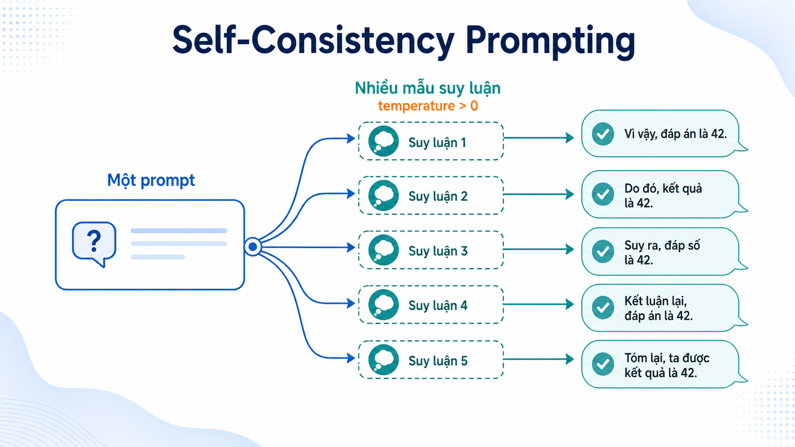

# Self-Consistency Prompting with LM Studio

  

Repo này là một mini CodeLab để thử nghiệm `self-consistency prompting` với local LLM chạy qua **LM Studio**.

Mục tiêu của project là trả lời 3 câu hỏi:

1. Nếu chỉ gọi model một lần, kết quả baseline trông như thế nào?
2. Nếu gọi model nhiều lần rồi tổng hợp kết quả, chất lượng có tốt hơn không?
3. Với bài toán reasoning tự do, nên vote trực tiếp trên nhãn hay gom theo ngữ nghĩa?

## Repo gồm những gì?

- [baseline.ipynb](./baseline.ipynb)  
  Bản đơn giản nhất của self-consistency. Notebook này phù hợp cho các bài toán classification có tập nhãn rõ ràng như `IMPORTANT` / `NOT IMPORTANT`.

- [main.ipynb](./main.ipynb)  
  Bản mở rộng cho free-form reasoning. Notebook này dùng **embedding + cosine similarity** để gom các câu trả lời gần nghĩa trước khi chọn đáp án cuối cùng.

- [test.ipynb](./test.ipynb)  
  Notebook benchmark trên tập con của **GSM8K**. Notebook này so sánh `Standard prompting` với `Self-consistency prompting`, ghi kết quả ra CSV, rồi phân tích accuracy, delta accuracy, consistency và các nhóm lỗi.

- [lab_results_gsm8k_20.csv](./lab_results_gsm8k_20.csv)  
  File kết quả benchmark mẫu để `test.ipynb` đọc lại và phân tích.

## Ý tưởng cốt lõi

Thay vì tin vào một lần suy luận duy nhất, self-consistency sẽ:

1. Gọi model nhiều lần với cùng một prompt.
2. Dùng `temperature > 0` để tạo ra nhiều đường suy luận khác nhau.
3. Tìm “phe” câu trả lời xuất hiện ổn định nhất.
4. Dùng kết quả đó làm đáp án cuối cùng.

Có hai kiểu tổng hợp chính trong repo này:

- **Label voting**: dùng khi output là nhãn rõ ràng.
- **Semantic grouping**: dùng khi output là câu trả lời tự do, có thể khác câu chữ nhưng cùng ý nghĩa.

## 1. `baseline.ipynb`

Notebook này phù hợp cho các bài toán classification.

Flow:

1. Chạy model một lần để lấy baseline.
2. Chạy nhiều lần để lấy nhiều mẫu suy luận.
3. Trích nhãn cuối cùng từ từng response.
4. Majority vote trên nhãn.

Ưu điểm:

- Code rất gọn.
- Dễ giải thích.
- Dễ hậu xử lý.

Giới hạn:

- Phụ thuộc model phải trả về format ổn định.
- Không phù hợp lắm với câu trả lời dài hoặc nhiều cách diễn đạt.

## 2. `main.ipynb`

Notebook này phù hợp cho reasoning task tự do hơn.

Flow:

1. Gọi model nhiều lần để lấy nhiều response.
2. Chuyển từng response thành embedding.
3. Tính cosine similarity giữa các response.
4. Gom các response gần nghĩa vào cùng nhóm.
5. Chọn nhóm đồng thuận mạnh nhất.
6. Chọn một câu đại diện trong nhóm thắng làm `final answer`.

Ưu điểm:

- Không cần các response phải giống hệt nhau.
- Hợp với output tự do hơn baseline voting.

Giới hạn:

- Cần embedding model.
- Logic dài hơn.
- Phải chọn `similarity threshold` hợp lý.

## 3. `test.ipynb`

Notebook này là phần thực nghiệm.

Nó làm 2 việc:

1. Chạy benchmark trên `20` mẫu ngẫu nhiên từ tập test của **GSM8K**
2. Phân tích lại file CSV kết quả

Các phân tích hiện có:

- Accuracy tổng thể của `Standard` và `Self-Consistency`
- `Delta Accuracy`
- Biểu đồ cột so sánh hai phương pháp
- Mối tương quan giữa `consistency` và `sc_correct`
- Các nhóm case quan trọng:
  - `STD sai nhưng SC đúng`
  - `STD đúng nhưng SC sai`
  - `Cả hai đều sai`

Lưu ý: với CSV hiện tại, notebook mới phân tích được trên các cột tổng hợp như `std_ans`, `sc_ans`, `std_correct`, `sc_correct`, `consistency`. Nếu muốn phân tích sâu hơn về độ dài chain-of-thought hoặc sự đa dạng của từng luồng suy luận, bạn cần log thêm raw outputs vào CSV.

## Yêu cầu môi trường

- LM Studio đang chạy local server tại `http://localhost:1234`
- Có chat model đang được load trong LM Studio
- Với [main.ipynb](./main.ipynb), cần thêm embedding model
- Python environment có các thư viện:
  - `openai`
  - `numpy`
  - `scikit-learn`
  - `pandas`
  - `matplotlib`
  - `datasets`

## Cách chạy

1. Mở LM Studio và bật local server.
2. Load chat model cần dùng.
3. Nếu chạy [main.ipynb](./main.ipynb), load thêm embedding model.
4. Mở notebook trong Jupyter hoặc VS Code.
5. Chạy lần lượt từ trên xuống dưới.

Nếu bạn muốn chạy benchmark:

1. Mở [test.ipynb](./test.ipynb)
2. Chạy cell chuẩn bị dữ liệu GSM8K
3. Chạy cell benchmark để sinh `lab_results_gsm8k_20.csv`
4. Chạy tiếp các cell phân tích ở cuối notebook

## Hình minh hoạ

- [01-branching-paths.png](./assets/self_consistency/01-branching-paths.png)
- [02-embedding-similarity.png](./assets/self_consistency/02-embedding-similarity.png)
- [03-majority-vote.png](./assets/self_consistency/03-majority-vote.png)

## Nguồn gốc kỹ thuật

Ý tưởng trong repo này được **mình lấy và phát triển từ tài liệu Prompt Engineering của Google**.

Cụ thể, phần implementation ở đây là một adaptation từ các nguyên tắc Google trình bày về:

- viết prompt rõ ràng và có ràng buộc format,
- step-by-step reasoning,
- thử nghiệm với `temperature`,
- và tổng hợp nhiều response để tăng độ ổn định.

Tài liệu chính thức:

- Google AI for Developers, [Prompt design strategies](https://ai.google.dev/gemini-api/docs/prompting-strategies)
- Google Cloud, [Prompt engineering: overview and guide](https://cloud.google.com/discover/what-is-prompt-engineering)
- Google Cloud Vertex AI, [Overview of prompting strategies](https://cloud.google.com/vertex-ai/generative-ai/docs/learn/prompts/prompt-design-strategies)

Lưu ý: notebook trong repo này không phải bản sao trực tiếp từ tài liệu Google. Đây là phần mình tự hiện thực lại cho mục đích học tập, minh hoạ và benchmark với LM Studio.

